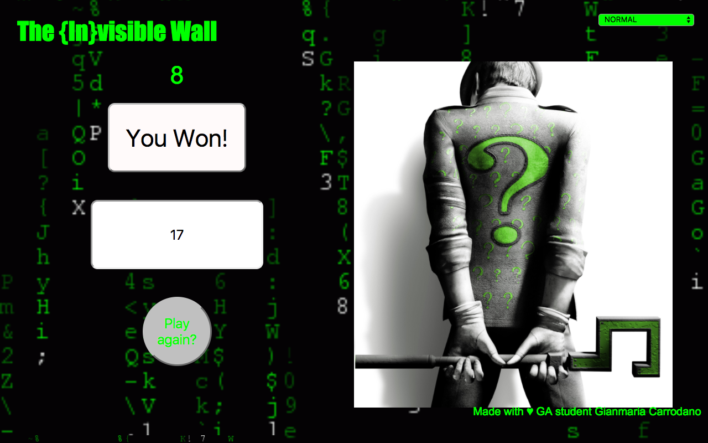

# GA WDI London - Project-1

# The {In}visible Wall

If you want play it : https://fathomless-refuge-21877.herokuapp.com/

# Rules

It is a mathematical game on three different levels.
There is a timer that triggers when you click on start game button, the questions are directly proportionate to the level you choose, do not try the savant mode.
Whenever the answer is correct a cell that covers the image to be discovered will disappear and giving you three seconds bonus, contrary if the answer is incorrect the cell that was missing, it will reappear making you harder see the hidden image.
The win condition is  be able to see the hidden image.
The lose condition is to get the timer to zero.

# Development

The code is pretty much on the function that triggers the start of the game and  the timer, as mentioned before and hides the div left2 and left to display the submit button, answer button  and the button where question is displayed.
The other functions that develop the game is the function that allows me to generate the timer with countdown to zero, then follows the function that allows me to declare victory if all the cells were made to disappear. Then the function that checks the correctness of the response with the use of if and within that other triggers with jquery html display in case you want to play again.Subsequently if the answer is correct others questions will be create allowing you to advance in the game. Finally the function that determines the end of the game when the timer ends.
I also wanted add three levels and then another function allows me to create applications based on the level chosen by the diversification of operators and the length of the numbers. Closes the code the function that resets the game doing all the cells reappear  * simultaneously*.

There are sounds That are triggered upon:

The beginning of the game loop
A correct answer
Game over

# Technologies
HTML 5, CSS and jQuery were used to create this game.
ClipConverter was used to load the sounds.

# Problems & challenges

The greatest difficulty I encountered in the project has been able to manipulate time timer  and create three different levels but particularly be able to make disappear and reappear randomly cells.

With more time and more web developer tools I'd like to differentiate the subject of questions and improve interaction with the player.
